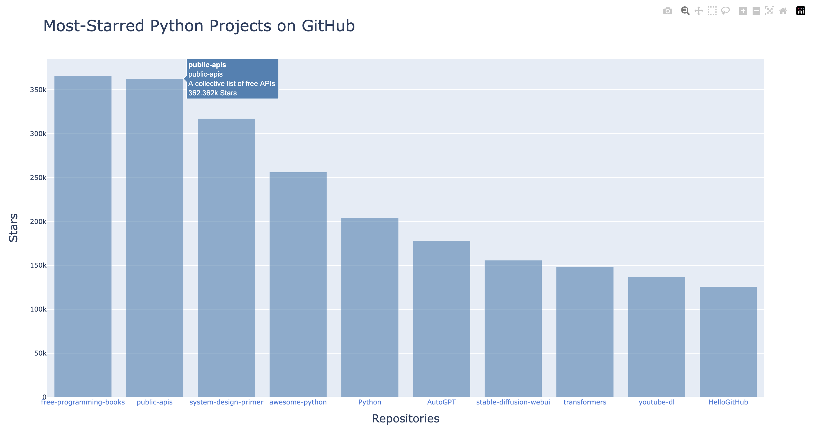

# GitHub Repository Charts


This project fetches and visualizes the most-starred GitHub repositories for a specified programming language using GitHub’s Search API and Plotly to display a bar chart sorted by your preferences.

## Installation

To get started, clone the repository and install the required dependencies:

```bash
git clone https://github.com/DylanConvery/GitHub-Repository-Charts.git
cd github-repository-charts
pip install -r requirements.txt
```

> **Note:** On some systems, especially on Windows, you may need to use `python3` and `pip3` instead of `python` and `pip` to ensure you are using the correct Python version.

## Usage

Run the script with optional arguments to customize the output. If no arguments are provided, default values will be used.

```bash
python3 github_repository_visualizer.py [OPTIONS]
```

### Available Arguments

- `--language` (default: `python`)  
  The programming language to search repositories for.

- `--order` (default: `desc`)  
  The order to sort the repositories by stars. Options: `asc` or `desc`.

- `--minimum-stars` (default: `10000`)  
  The minimum number of stars a repository must have to be included.

- `--total-repos` (default: `100`)  
  The total number of repositories to fetch and display.

- `--page-size` (default: `50`)  
  The number of repositories to fetch per API request page.

### Example Usage

```bash
# With flags
python github_repository_visualizer.py --language python --order desc --minimum-stars 10000 --total-repos 20 --page-size 50

# Without flags (uses defaults)
python github_repository_visualizer.py
```

## Output

The script generates an interactive bar chart displaying the most-starred GitHub repositories for the specified language. The chart is saved as an HTML file and opened automatically in your default web browser.

👉 [View the interactive chart (GitHub Pages)](https://dylanconvery.github.io/GitHub-Repository-Charts/)

